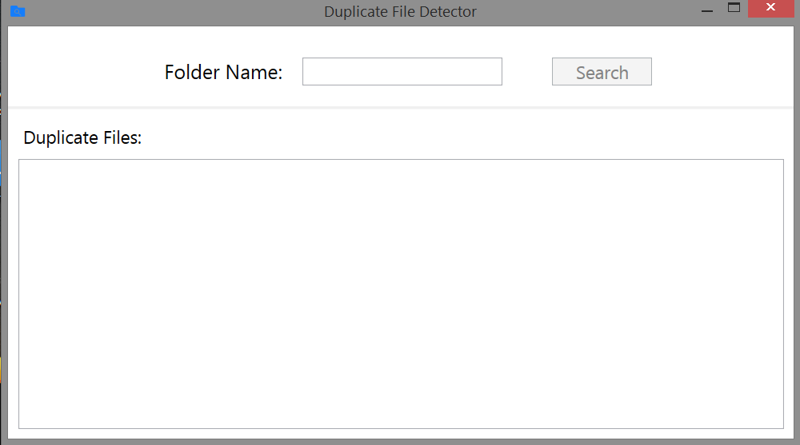
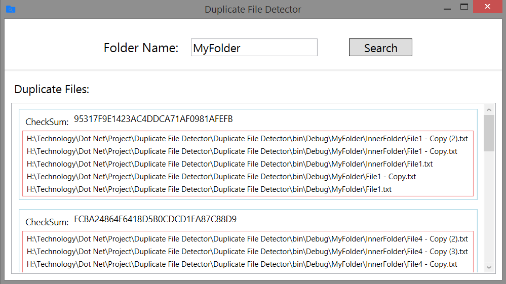
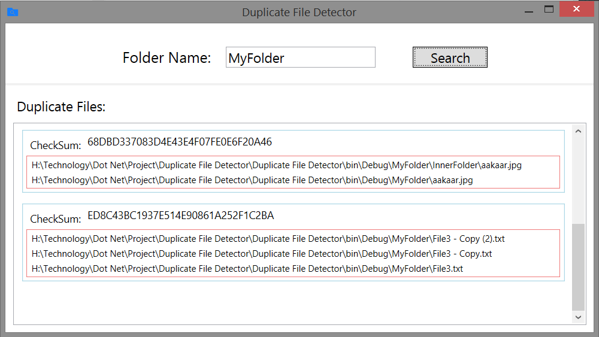
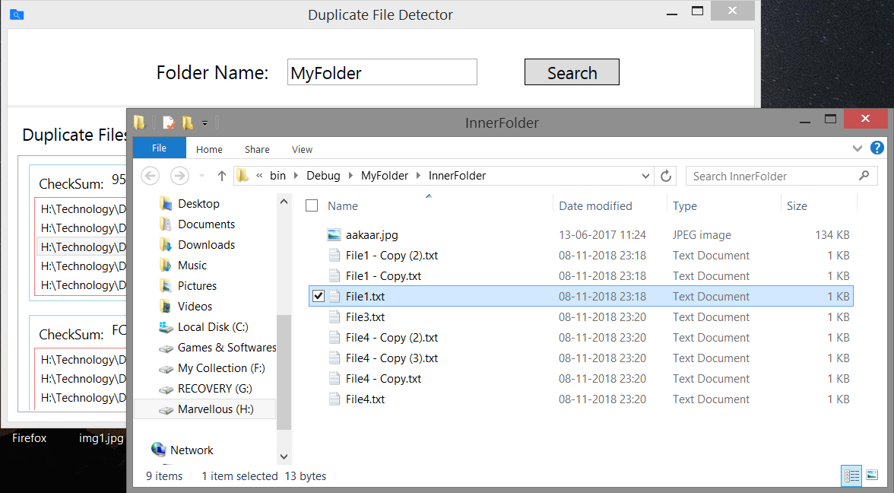

# Duplicate File Detector

This application find Duplicate files present in specify Folder. All kind of file will be detector like .txt, .jpg, .exe.

- __Framework:__ Dot Net.
- __Front End:__ Windows Presentation Foundation (WPF)
- __Back End:__ C#.
- __Platform:__ Windows.

---

## Features

- Properly display the list of duplicate file.
- After searching you can double click the file to open the directory where this file is present.

---
## Project ScreenShot

1. First Look of Duplicate File Detector

---

2. Duplicate Files are listed

---

3. Photo file is also be detector

---

4. You can open displayed file by double clicking it.

File is open in explorer.exe. You can then decide to delete or not to delete file.

---
---